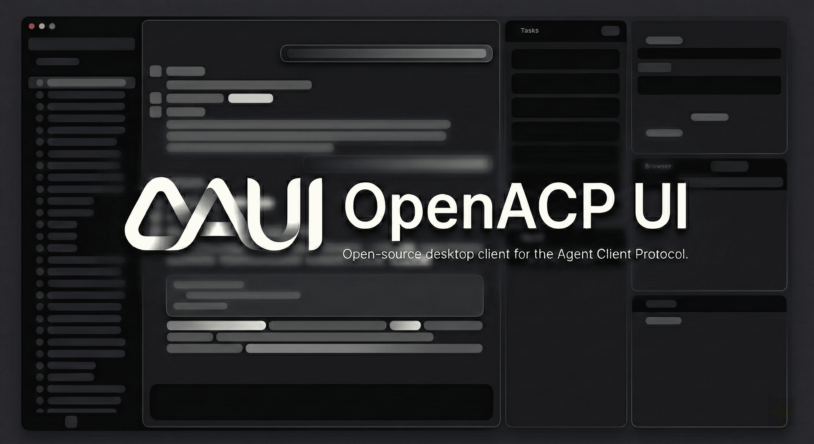

<div align="center">
  
</div>

<h1 align="center">OAgent</h1>

<p align="center">
  <strong>The open-source desktop workspace for agentic development workflows.</strong>
</p>

<p align="center">
  <a href="#features">Features</a> •
  <a href="#quick-start">Quick Start</a> •
  <a href="#architecture">Architecture</a> •
  <a href="#contributing">Contributing</a>
</p>

## Introduction

OAgent is a powerful open-source Electron desktop client designed to streamline agentic workflows. Built to support the Agent Client Protocol (ACP) and seamlessly integrate with Model Context Protocol (MCP) tools, OAgent provides a unified workspace to interact natively with your code, models, and tools.

With native access to the system filesystem, a built-in terminal multiplexer, a web browser capability, and Git tooling out-of-the-box, OAgent transforms the way you pair-program with AI agents.

## Features

- **Multi-session Workspace:** Run multiple concurrent agent sessions seamlessly with persistent chat histories.
- **Background Agents:** Execute multi-turn tasks via async background agents, keeping your main interface ready for new commands.
- **Provider Support:** Natively supports OpenRouter, Ollama, and customizable local workflows.
- **Deep Integrations:** A native terminal panel, file inspector, Markdown diff viewer, and integrated browser right within the tool loop.
- **MCP Tooling:** First-class extensibility with dynamic Model Context Protocol (MCP) renderer registration.
- **Local Privacy:** Projects, session states, and workspace settings are saved locally to your filesystem, offering total data control and privacy.

## Quick Start

### Prerequisites

- Node.js 20+
- pnpm 10+
- macOS (Tahoe+ recommended for Liquid Glass transparency), Windows, or Linux

### Installation

Clone the repository and install the dependencies to get started:

```bash
git clone https://github.com/samhu1/openagent.git
cd openagent
pnpm install
```

### Running the Application

Start the development server with Hot Module Replacement (HMR) for both the renderer process and the main process:

```bash
pnpm dev
```

### Local Models (Optional)

If you'd like to use a local model such as Llama 3 for inference with Ollama:

```bash
ollama run llama3.2
```

### Production Build

Package the application for distribution based on your current OS:

```bash
pnpm build
pnpm dist
```

## Documentation

Dive deeper into our internals to extend or build upon OAgent:

- [**Architecture & Design**](docs/architecture.md) - Learn about Electron IPC layering, Subagent routing, Context compaction, and the MCP registry.
- [**Development Guide**](docs/development.md) - Open-source readiness checklists, command references, and core workflows.
- [**Contributing Guidelines**](CONTRIBUTING.md) - Pull request expectations and repository conventions.
- [**Code of Conduct**](CODE_OF_CONDUCT.md) - Community standards.

## Troubleshooting

- **Dependencies:** If startup fails after dependency updates, ensure a clean state using `pnpm install --frozen-lockfile`.
- **Electron Reloads:** If Electron hangs after major renderer structural changes, rebuild the Electron target using `pnpm build:electron`.
- Consult our [**Support**](SUPPORT.md) guide if you continue experiencing issues.

## Security

Please refer to our [**Security Policy**](SECURITY.md) for how to responsibly report vulnerabilities. Do not file open issues for suspected security concerns.

## License

OAgent is licensed under the MIT License - see the [LICENSE](LICENSE) file for details.
